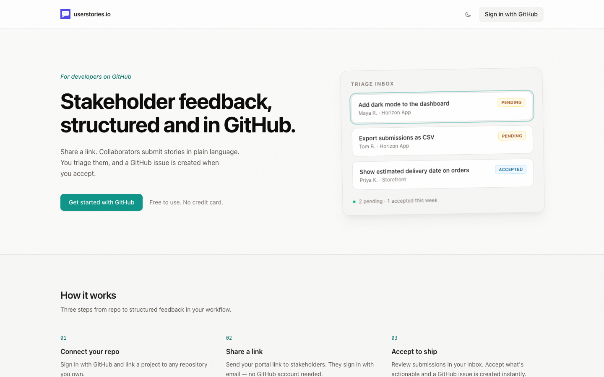
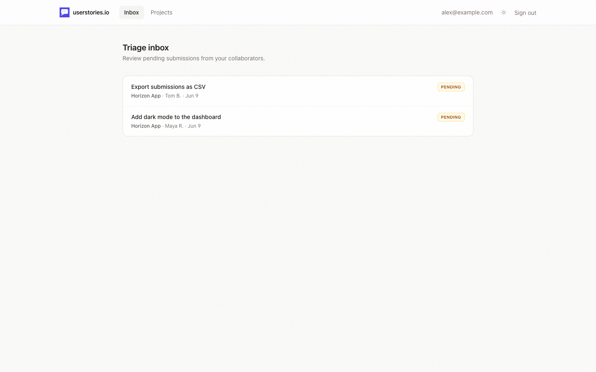
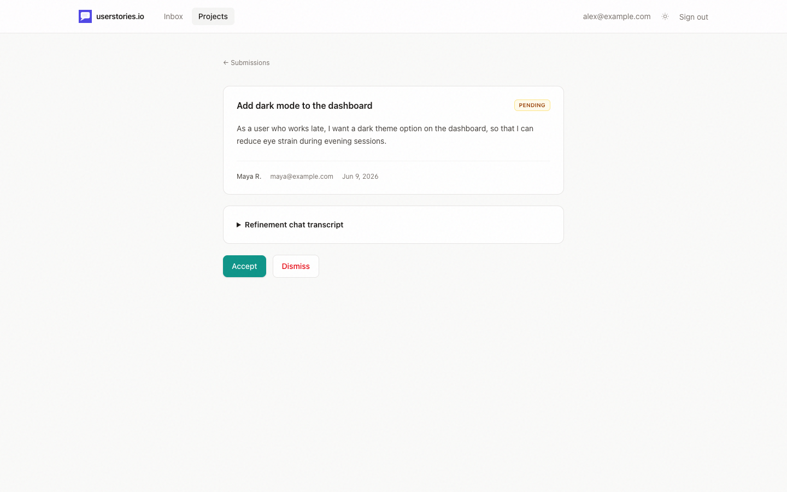
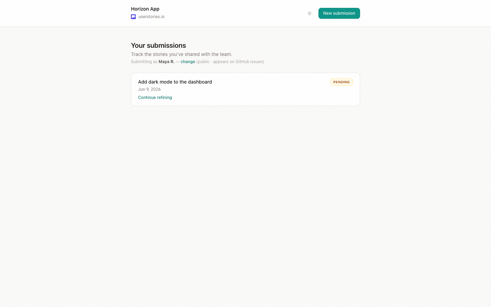
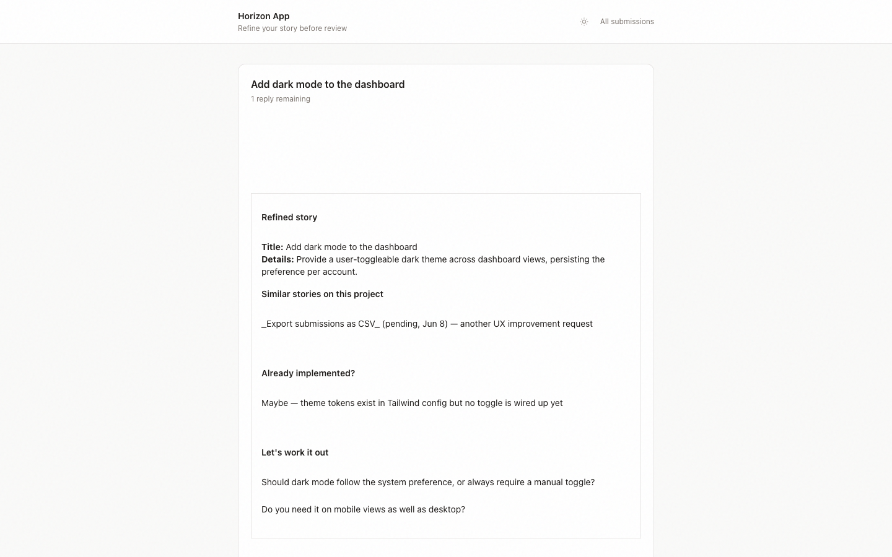
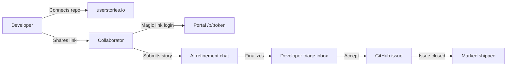

# userstories.io

[](https://github.com/ericdahl-dev/userstories.io/actions/workflows/ci.yml)
[](https://www.ruby-lang.org/)
[](https://rubyonrails.org/)
[](https://www.postgresql.org/)
[](https://hotwired.dev/)

**Stakeholder feedback, structured and in GitHub.**

userstories.io is a lightweight collaboration tool that lets non-technical stakeholders submit user stories directly into a developer's GitHub workflow — without needing a GitHub account. Share a link, collect stories in plain language, triage them in your inbox, and open GitHub issues when you accept.

<p align="center">
  <a href="docs/screenshots/landing-page.png">
    
  </a>
</p>

---

## Screenshots

<table>
  <tr>
    <td align="center" width="50%">
      <a href="docs/screenshots/triage-inbox.png">
        
      </a>
      <br><em>Developer triage inbox</em>
    </td>
    <td align="center" width="50%">
      <a href="docs/screenshots/submission-review.png">
        
      </a>
      <br><em>Review, accept, or dismiss</em>
    </td>
  </tr>
  <tr>
    <td align="center" width="50%">
      <a href="docs/screenshots/collaborator-portal.png">
        
      </a>
      <br><em>Collaborator portal</em>
    </td>
    <td align="center" width="50%">
      <a href="docs/screenshots/refinement-chat.png">
        
      </a>
      <br><em>AI story refinement</em>
    </td>
  </tr>
</table>

> Regenerate screenshots after UI changes: `SKIP_COVERAGE=1 bundle exec rspec spec/system/readme_screenshots_spec.rb`

---

## Why it exists

Developers want feedback from the people who use their software. But GitHub Issues, Linear, and Jira are unfamiliar to most collaborators — so ideas end up scattered across Slack, email, and sticky notes.

userstories.io sits in the middle:

| **Collaborators** | **Developers** |
|---|---|
| Simple submission portal via shareable link | Triage inbox for pending stories |
| Magic-link login — no password, no GitHub account | Accept or dismiss before anything hits your backlog |
| Track status from submission to shipped | GitHub issues created automatically on acceptance |

---

## How it works



1. **Connect** — Sign in with GitHub and link a project to a repository.
2. **Share** — Send the portal link (`/p/:share_token`) to stakeholders.
3. **Submit** — Collaborators log in via email magic link and write user stories.
4. **Refine** — An optional AI chat helps sharpen the story against repo context and past submissions.
5. **Triage** — Review pending submissions; accept what belongs in the backlog.
6. **Ship** — Accepted stories become GitHub issues; collaborators see progress through to delivery.

---

## Features

### For developers
- GitHub OAuth sign-in with encrypted token storage
- Projects linked to any repo you own
- Shareable portal links (rotatable to revoke access)
- Triage inbox across all projects
- One-click accept → GitHub issue creation with backlink
- Dismiss noise without polluting your issue tracker
- Manual or synced **shipped** status when issues close

### For collaborators
- No GitHub account required
- Passwordless magic-link authentication
- Persistent sessions across visits
- Submission history with live status (`pending` → `accepted` → `shipped`)
- AI-assisted story refinement grounded in project history and repo context

---

## Tech stack

| Layer | Choice |
|---|---|
| Framework | Ruby on Rails 8.1 |
| Ruby | 3.4.6 |
| Database | PostgreSQL 16 |
| Frontend | Hotwire (Turbo + Stimulus), Tailwind CSS, importmap |
| Auth | Devise + OmniAuth (GitHub), magic links for collaborators |
| Jobs | Good Job (Postgres-backed — no Redis required) |
| Cache / Cable | Solid Cache, Solid Cable |
| Email | Letter Opener (dev), Resend (production) |
| AI | OpenRouter (optional, for story refinement) |
| GitHub API | Octokit |
| Server | Puma + Thruster |

---

## Prerequisites

- Ruby **3.4.6** ([`.ruby-version`](.ruby-version))
- Bundler
- PostgreSQL **16+**
- A [GitHub OAuth App](https://docs.github.com/en/apps/oauth-apps/building-oauth-apps/creating-an-oauth-app) (callback URL: `http://localhost:3000/users/auth/github/callback`)

---

## Local development

### 1. Clone and install

```bash
git clone <repo-url>
cd userstories.io   # or your checkout directory
bundle install
```

### 2. Configure environment

```bash
cp .env.example .env
```

Fill in the required values (see [Environment variables](#environment-variables) below).

Generate Active Record encryption keys:

```bash
bin/rails db:encryption:init
# Copy the three ACTIVE_RECORD_ENCRYPTION_* values into .env
```

### 3. Set up the database

```bash
bin/rails db:prepare
```

Or run the full setup script (installs gems, prepares DB, starts the server):

```bash
bin/setup
```

The app runs at **http://localhost:3000**.

Magic-link emails open in the browser automatically via [Letter Opener](https://github.com/ryanb/letter_opener) in development.

### 4. Background jobs

Good Job runs **in-process** during development (no separate worker needed). In production, a dedicated worker process handles async jobs (refinement, GitHub sync, etc.).

Authenticated developers can inspect the job dashboard at `/jobs`.

---

## Environment variables

| Variable | Required | Description |
|---|---|---|
| `GITHUB_CLIENT_ID` | Yes | GitHub OAuth app client ID |
| `GITHUB_CLIENT_SECRET` | Yes | GitHub OAuth app client secret |
| `ACTIVE_RECORD_ENCRYPTION_PRIMARY_KEY` | Yes | From `bin/rails db:encryption:init` |
| `ACTIVE_RECORD_ENCRYPTION_DETERMINISTIC_KEY` | Yes | From `bin/rails db:encryption:init` |
| `ACTIVE_RECORD_ENCRYPTION_KEY_DERIVATION_SALT` | Yes | From `bin/rails db:encryption:init` |
| `DATABASE_URL` | Prod / CI | PostgreSQL connection string |
| `RAILS_MASTER_KEY` | Prod | Decrypts `config/credentials.yml.enc` |
| `APP_HOST` | Prod | Public hostname (e.g. `userstories.io`) |
| `OPENROUTER_API_KEY` | Optional | Enables AI story refinement |
| `OPENROUTER_MODEL` | Optional | Model override (default: `openai/gpt-4o-mini`) |
| `RESEND_API_KEY` | Prod | Set via Rails credentials (`resend.api_key`) |
| `STORAGE_PROVIDER` | Prod | `local`, `minio`, or `amazon` |

See [`.env.example`](.env.example) for the full local template.

---

## Testing

```bash
# Full suite
bundle exec rspec

# With coverage (CI default)
COVERAGE=true bundle exec rspec

# Local CI pipeline (setup, RuboCop, security scans)
bin/ci
```

GitHub Actions runs security scans, lint, and tests on every push and pull request to `main`.

---

## Deployment

Production runs as Docker Compose services: **web** (Puma + Thruster), **worker** (Good Job), and **Postgres**.

```bash
# Build and start
docker compose up --build

# Required env vars — see docker-compose.yml
# RAILS_MASTER_KEY, DATABASE_URL, GITHUB_CLIENT_*, APP_HOST, encryption keys, etc.
```

Health check endpoint: `GET /up`

---

## Project documentation

| Doc | Contents |
|---|---|
| [`docs/executive-summary.md`](docs/executive-summary.md) | Product vision, problem, MVP scope |
| [`docs/user-stories.md`](docs/user-stories.md) | Feature stories with acceptance criteria |
| [`docs/data-model.md`](docs/data-model.md) | Entity relationships and lifecycle |
| [`docs/adr/`](docs/adr/) | Architecture decision records |

---

## Contributing

1. Create a feature branch off `main` (never commit directly to `main`).
2. Write or update specs for behavior changes (RSpec + Capybara).
3. Run `bin/ci` and ensure it passes before opening a PR.
4. Follow existing code style (`bin/rubocop`).
5. Update README screenshots if you change UI: `script/generate_screenshots.rb`

---

## License

Private / all rights reserved unless otherwise specified.
